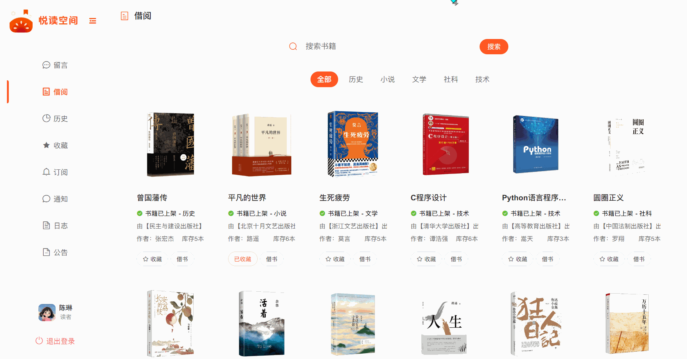
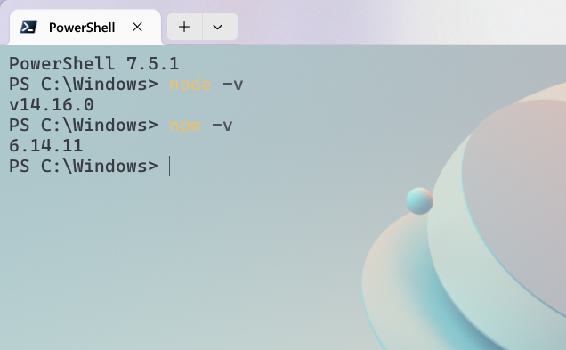
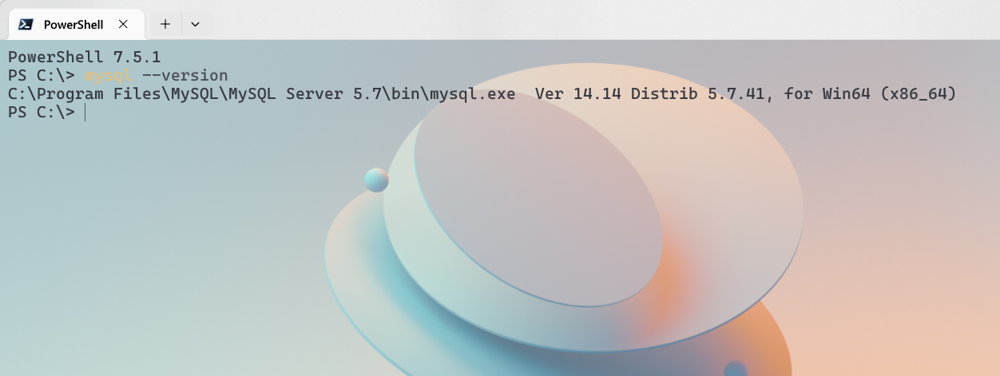
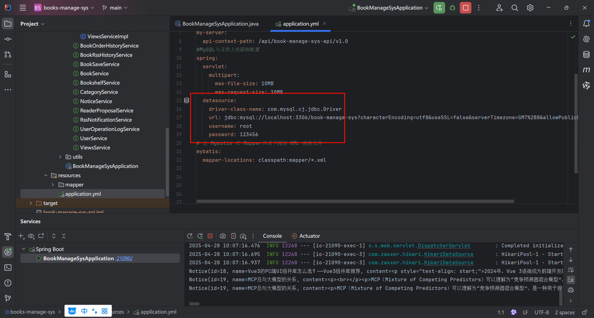
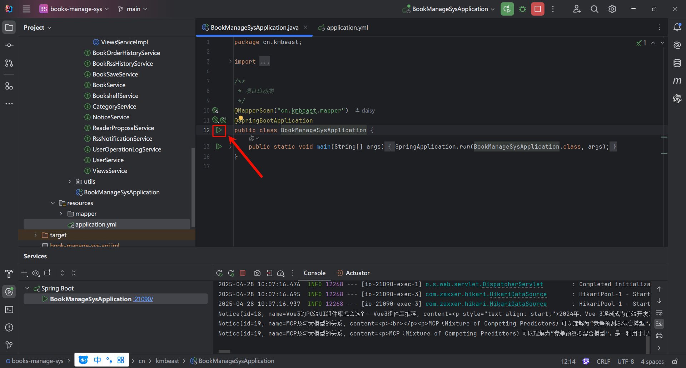
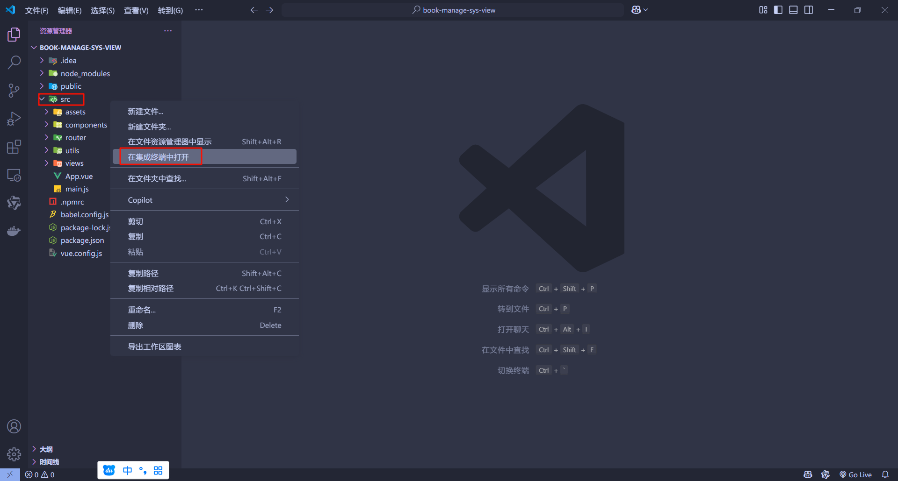
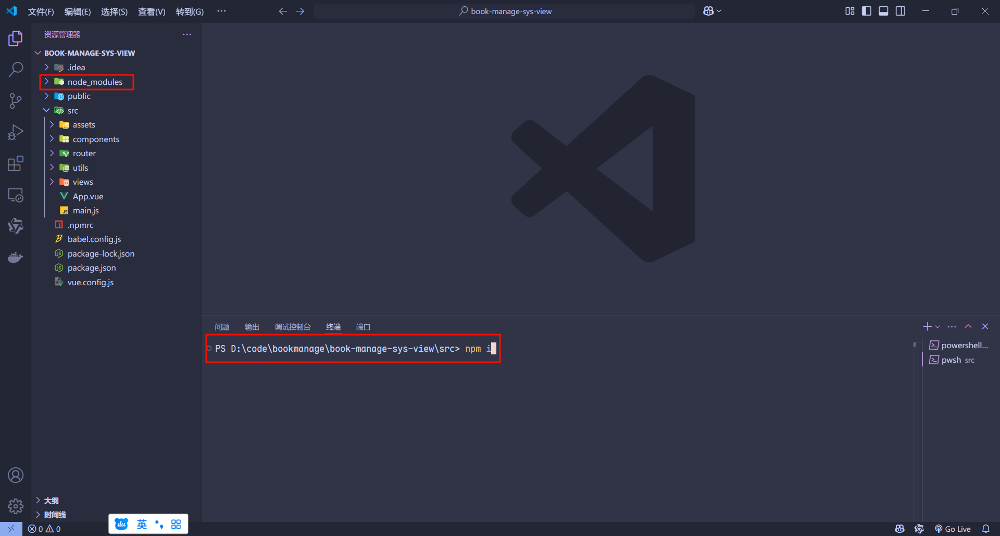
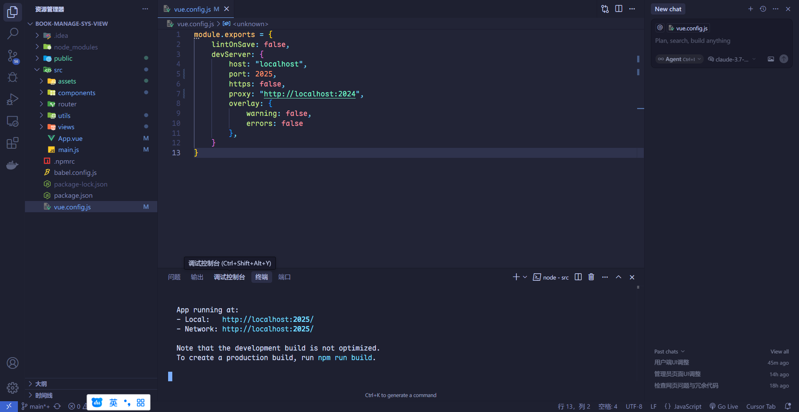

# 高颜值图书管理系统

 

 

### 项目使用环境

本项目是前后端分离开发的，前端使用 **VScode**，后端使用 **IDEA**。

- **Node.js**: 14.16.0  
  
  
- **MySQL**: 5.7.41  
  

> 注意：这两个环境版本要一样，不然容易出问题。

### 后端部署

后端项目名为 `books-manage-sys`，用 IDEA 打开后，配置好 Maven 和数据库。

点击运行按钮，后端启动。

### 前端部署

前端文件夹 `book-manage-sys-view`，用 VScode 打开。

右键 `src` 文件夹在集成终端中打开。

1. 先运行 `npm i` 命令，安装好相关依赖
2. 再运行 `npm run dev`

启动成功出现链接，可在浏览器运行。

### 账号信息

| 角色     | 用户名  | 密码   |
| -------- | ------- | ------ |
| 管理员   | xiaoyan | 123456 |
| 读者用户 | chenlin | 123456 |